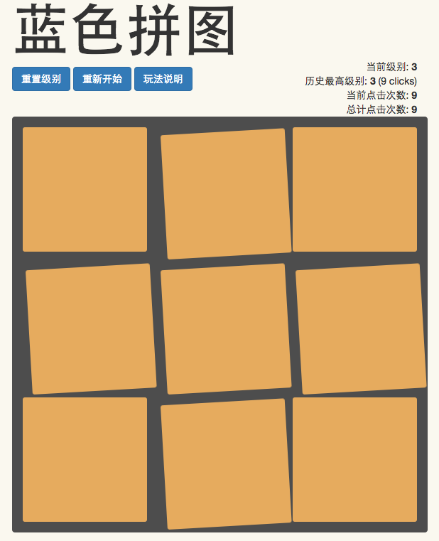

# Blue Puzzle

## 简介
这是一个简单的小游戏，非常容易上手，点击[这里](http://yexiaorain.github.io/webhek_puzzle/)开始吧！

### 看一个简单的截图吧！




----

# YeXiaoRain的Solver.c

Write by [YeXiaoRain](https://github.com/YeXiaoRain)

## Usage

**Step 1**

Use your favorite editor to open `solver.c`

Edit the GAMESIZE at line 2

```c
#define GAMESIZE 20
```

to the number you need to solve.

**Step 2**

compile it with `gcc -o solver solver.c`

**Step 3**

run it with `./solver`

## About Solver

For `n*n` Game

Time complexity is `O(n^2 * 2^n)`

Space complexity is `O(n^2)` which can reduce to `O(2*n)`

It cost `4.1s` to solve `20*20` puzzle and cost `3.9s` if caculating and checking last line at the same time.

---

## RapiD的修改

增加一个`solve`功能

以及license

For `n*n` Game

Time complexity is `O(n^4)`

Space complexity is `O(n^4)`

## license

>   Copyright (c) 2015 by rapidhere, RANTTU. INC. All Rights Reserved.

>   This program is free software: you can redistribute it and/or modify
it under the terms of the GNU General Public License as published by
the Free Software Foundation, either version 3 of the License, or
(at your option) any later version.

>   This program is distributed in the hope that it will be useful,
but WITHOUT ANY WARRANTY; without even the implied warranty of
MERCHANTABILITY or FITNESS FOR A PARTICULAR PURPOSE.  See the
GNU General Public License for more details.

>   You should have received a copy of the GNU General Public License
along with this program.  If not, see <http://www.gnu.org/licenses/>.
